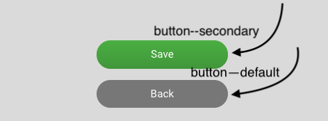

# Buttons

Web-ui-components include predefined button styles, each serving its own semantic purpose, with a few extras thrown in for more control.

## Usage
```<Button className="button--default" type="button" onClick={onClickHandler}>
    <FormattedMessage id="text.translated" defaultMessage="Translated text" />
</Button>```


## Available classNames for Buttons:
- ```button--secondary```
- ```button--primary```


- ```button--default``` (Always grey buttons)




- ```button--danger``` (Always red)

- ```button--icon``` (button with icon, i.e, )

<Button 
  className="button--icon"
  onClick={() => setFullScreen(!fullScreen)}
  title={intl.formatMessage({ id: !fullScreen ? 'history.full-screen' : 'history.restore' })}
  type="button">
  <FontAwesomeIcon className="fullScreen" icon={fullScreen ? faCompress : faExpand} size="2x" />
</Button>

- button--info (Scheduling)

<Button type="button"
                  key={mode.modeId}
                  className="button--info"
                  disabled={mode.modeId === 0}
                  onClick={() => this.props.onToggle(mode)}>
                  {mode.name}
                </Button>


- button--round (round button at Scheduling)
- button--option


